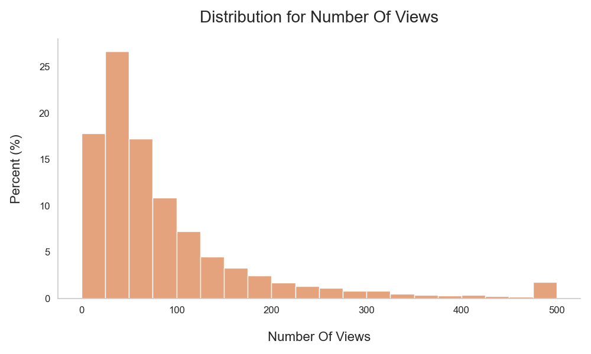
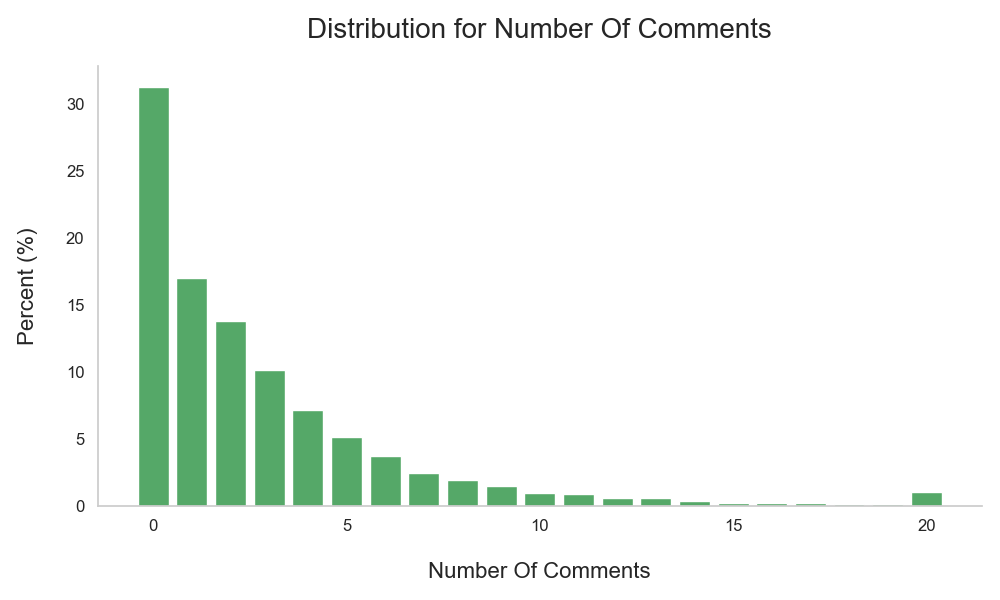
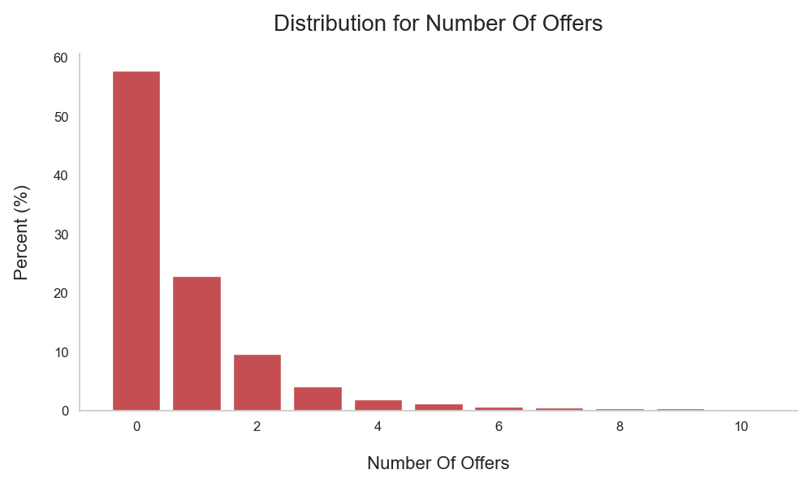
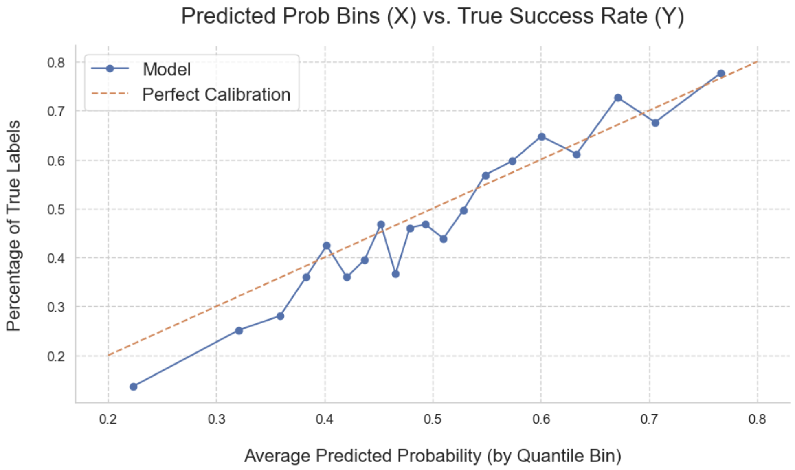
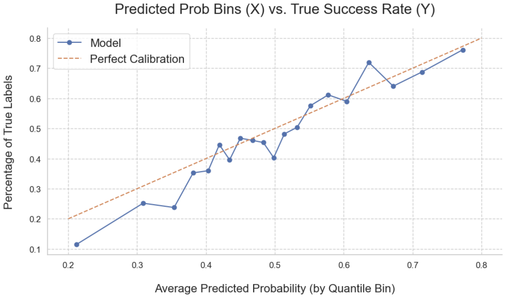
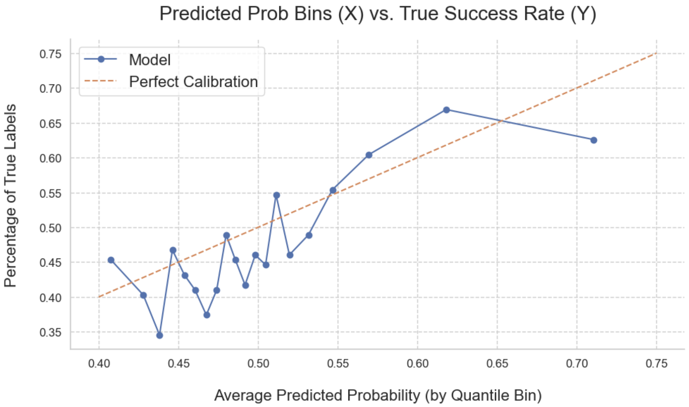
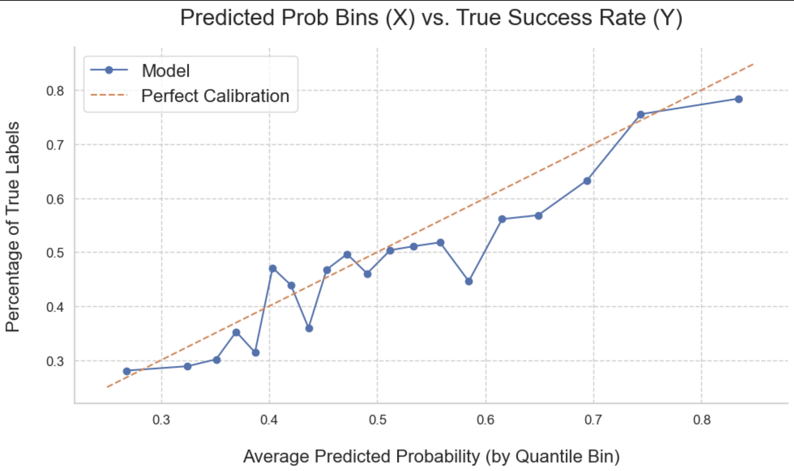

## Building and Evaluating AI Agents to Improve Job Referral Requests to Strangers

#### Initial Report 

#### Prepared by Ross Chu (ross.chu@berkeley.edu)

## Replication Files

- Data Preparation: [dataprep.ipynb](dataprep.ipynb)
- Exploratory Analysis: [explore.ipynb](explore.ipynb)
- Measuring the Quality of Referral Requests: [modelfit.ipynb](modelfit.ipynb)
- AI Agents to Improve Referral Requests (to be added)
- Refer to the [repository README](README_repo.md) for a description of modules created for each notebook
- Data files have **not** been uploaded due to their proprietary nature
- `poetry.lock` and `pyproject.toml` contain python dependencies set through `poetry`

## Executive summary

In this capstone project, I develop and evaluate a system of AI agents that help job seekers write effective job-referral requests on an anonymous discussion platform. First, I measure the quality of referral requests by fine-tuning a transformer to predict whether a request receives a referral. I then use this model to score original requests and their LLM revisions, and I add a retrieval-augmented generation (RAG) component to provide high-quality examples that are contextually similar to the user's request. 

The goal of this project is to evaluate whether AI agents are effective at improving referral requests in a measurable way. The baseline model is augmented with additional features to improve the quality of AI revisions, which will also be evaluated for their effectiveness. Furthermore, this project will examine job seekers that benefit the most from these AI revisions. 

## Rationale

Operators of anonymous discussion platforms are constantly looking for ways to create value for their users and increase their engagement with the platform. This is particularly true for `teamblind.com`, which aims to become a go-to destination for job seekers. In the `Jobs & Referrals` channel, job seekers connect with current employees who are interested in offering job referrals. However, less than half of job referral requests on this channel are successful at receiving referral offers. AI agents developed in this project create value for job seekers by helping them write effective referral requests that increase their chances of receiving job referrals.

## Research Questions

This project designs and implements a system of AI agents that help job seekers write effective referral requests. As part of the evaluation process, this project will answer three research questions: 

1. Is the AI agent effective at improving referral requests in a measurable way?

2. Do AI agents improve chances of referrals more effectively for some job seekers than others?

3. Which additional context makes the AI agent better at improving referral requests?

## Data Sources

### Text Data from an Anonymous Discussion Platform

`teamblind.com` is an anonymous discussion platform for tech-sector employees. A distinctive feature of this platform is that many users verify their accounts with corporate email addresses. I focus on the `Jobs & Referrals` channel, where 80% of posts are from job seekers seeking referrals from other users. 

Both requestors and providers benefit from these interactions. Job seekers improve their chances of receiving interviews through referrals, while providers often receive cash rewards if a referred candidate is successfully hired. AI agents developed in this project create value to job seekers by helping them craft more effective referral requests, and they also create value to referral providers by making it easier to identify promising candidates. 

### Data Preparation (`dataprep.ipynb`)

This builds on a prior project that explores a variety of text classification models that predict whether a referral request is successful at receiving referral offers. This project reuses pipelines to clean and prepare text data while making additional improvements for token masking. 

Text data from 17,542 posts and 27,150 comments have been collected from the `Jobs & Referrals` channel between February 29th and November 17th, 2024. For each post, there is information on the date, title, content, username, and corporate affiliation, along with engagement metrics such as views, likes, and comments. For each comment, there is data available on text content, username, affiliation, and likes.

Referral requests were identified by looking for general terms on referrals (e.g. "referral", "refer") and hashtags (e.g. "\#referral" or "\#needajob"). These were further narrowed down to posts that contain explicit requests for referrals (e.g. "need a referral", "can anyone refer me"). 

In this channel, it is customary for users to offer referrals by asking the poster to contact thme via direct messages. I use this behavior as proxy for offering job referrals, as I do not directly observe activity outside the platform. Referral offers are identified as comments that mention direct messages and offers to help (e.g. "DM me for Google", "happy to help"). Within this subset, comments were excluded if they resemble referral requests more so than referral offers (e.g. "Can I also DM for Google?"). This filter is necessary because posts with referral offers tend to attract comments by other candidates who are also seeking referrals themselves.

### Token Masking

Mask tokens were used to intentionally obscure certain information from referral requests. Examples include professions, salaries, seniority, years of experience, and current employers. The goal is for the transformer to predict success rates based on how the referral request is written, rather than based on circumstances that cannot be changed. This also prevents AI agents from improving referral requests by filling in for certain attributes that are not applicable to the job seeker. 

Mask tokens were used to hide certain details in referral requests, such as profession, salary, seniority, years of experience, and current employer. This forces the transformer to predict success based on **how** the request is written, rather than on fixed circumstances that the job seeker cannot change. It also prevents AI agents from "improving" referral requests by altering fixed attributes that are not applicable for the job seeker. Tokenizers for transformers were updated so that they are aware of these special tokens.

### Exploratory Data Analysis (`explore.ipynb`)

During the 37-week sample period, 80% of posts in this channel correspond to referral requests by job seekers. 85% of these requests are made by users with verified corporate accounts, and less than half of them contain comments with referral offers from other users. The figure below shows the time series of referral requests, which exhibit seasonal patterns with peaks and troughs that align with active and inactive recruitment cycles for employers in the technology sector. Overall, these patterns suggest that this platform captures real job seeking behavior among tech sector professionals. 

    

The figures below show the distribution of views, comments, and offers across job referral requests. Engagement metrics are highly skewed, and comments and offers resemble an exponential distribution with diminishing frequencies. Job referral requests are mostly noticed by other users (views > 0), but many of them do not receive any engagement from other users: 54% of requests do not receive referral offers, and 31% do not receive any comments at all. 

      

## Measuring the Quality of Referral Requests

### Models for Feature Engineering and Classification

I measure the quality of a job referral request by training a model to predict its probability of receiving referral offers from other users. I formulate this problem as a binary classification task for receiving at least one offer. 

The classification model consists of two components: 1) a feature engineering model that converts text data into numerical inputs, and 2) a classification model that users numerical inputs to predict whether a referral request receives an offer. XGBoost and logistic regressions (with L1 regularization) were considered for classification models, and three models were considered for feature engineering: a transformer model, TF-IDF model (unigrams/bigram frequencies), and a linguistic model with semantic features motivated from domain knowledge and academic literature on making effective requests.

### Evaluation Metrics

Among the above options, the best performing model was a regularized logistic regression with a transformer that converts text into 768-dimensional embeddings. Model performance was evaluated on a variety of metrics: 

1. **AUROC:** the trade-off between true positive and false positive rates, also interpreted as the probability that a randomc hosen successful request has higher predicted success than a randomly chosen unsuccessful request

2. **Accuracy:** the proportion of requests with identical true and predicted labels

3. **Precision:** the percent of requests that were predicted to be successful (p > 0.5) that were actually successful

4. **Recall:** the percent of successful requests that the model correctly identified as being successful

5. **F1-Score:** the harmonic mean of precision and recall

6. **Calibration Plots:** the relationship between predicted success rates and actual success rates (better to be closer to the 45-degree line)

These metrics are suitable for measuring model performance, and they capture properties we would expect from a good classification model: a model that predicts labels that closely align with ground truth (accuracy/precision/recall/f1-score), predicts higher probabilities for successful requests (AUROC), and neither over-predicts nor under-predicts actual chances of receiving referral offers. To avoid leakage, these metrics will only be evaluated on a held-out set that the transformer has never seen before. 

### Parameter Tuning

For the logistic regression, the L1 penalty term was optimized on AUROC using Grid Search with Cross Validation. In addition to a pre-trained sentence transformer (`sentence-transformers/all-distilroberta-v1`), I additionally fine-tuned parameters with LoRA to ensure that transformer embeddings contain informative content that is helpful for predicting referral offers. For this procedure, gradients were computed for cross entropy (logistic log-loss), and the best performing model was selected on AUROC. 

### Predictve Performance (`modelfit.ipynb`)

To evaluate predictive performance, I compare these models with a baseline model that randomly predicts a request to be successful with 46% probability (= empirical success rate in training data). This baseline model is essentially a coin flip: its calibration curve is flat, AUROC is 0.50, and precision, recall, and F1 are all 0.46. These values serve as benchmarks for the results below.

A key component for measuring the quality of referral requests is to train a model that is good at predicting whether they receive referral offers. The calibration plots below compare predicted success rates against actual results on a held-out set of referral requests that the transformer has never seen before. Referral requests are grouped into quantile bins by their predicted success probabilities (horizontal axis), and scatter points correspond to proportions of those requests that actually receive referral offers. The 45-degree line indicates perfect calibration, where predicted success rates align with ground truth probabilities within each bin. 

     

The left figure is from the pre-trained transformer, and the right figure is its fine-tuned counterpart. While both transformers are calibrated well between predicted and empirical probabilities, the fine-tuned model performs slightly above the pre-trained model on (out-of-sample) performance metrics, as seen in the table below. Although these differences are not statistically significant given their small magnitudes, the fine-tuned model does appear to be a pareto improvement across all performance metrics. Accordingly, the fine-tuned transformer has been chosen as the main model for measuring the quality of job referral requests. 

| Performance Metric | Fine-tuned |      | Pre-Trained |
| :----------------: | :--------: | :--: | :---------: |
| AUROC     | 0.681  | > | 0.679  |
| Accuracy  | 0.630  | > | 0.625  |
| F1-Score  | 0.630  | > | 0.624  |
| Precision | 0.613  | > | 0.610  |
| Recall    | 0.604  | > | 0.583  |

The calibration plots below consider two alternative models for feature engineering. These models have not been chosen because they perform below transformers on evaluation metrics. The left figure corresponds to a featurized model with linguistic features motivated from domain knowledge and prior literature. The right figure corresponds to a TF-IDF model with unigrams and bigrams scaled by overall frequency.

     

The featurized model achieves a AUROC of 0.576, while the TF-IDF model achieves a AUROC of 0.647. Both models are reasonably calibrated, with true success rates correlating positively with predicted success rates. However, transformers are closer to the 45-degree line than either of these models (indicating better calibration). While transformers have been chosen for their superior performance, these models could have been reasonable choices before this technology was developed in 2017.

## AI Agents to Improve Referral Requests (`in progress`)

### Improving Success Rates for Referral Requests 

The `improver` agent will submit API requests to `openai` to improve job referral requests. Improvements will be measured as changes in the probability of receiving referrals from other users, which is predicted by the transformer discussed above. I will apply prompt engineering to both system prompts and user prompts to provide instructions on how to improve the title and content for the referral request.

### Providing Additional Context to Enhance AI Revisions

I will design two other agents to provide additional context to the `improver` agent, which may collectively enhance their ability to improve referral requests. First, I will design a `retriever` agent that adds a Retrieval-Augmented Generation (RAG) component to user prompts. The `retriever` agent indexes embeddings for successful referral requests in the training data, and it returns 5 examples that are semantically similar to the user's request. This would allow the `improver` agent to reference well-written examples that are contextually relevant to the user's request. 

Second, I will implement an `explainer` agent that uses `Captum AI` to assign attribution scores to phrases. This agent quantifies whether a particular sentence positively or negatively contributes to success rates predicted by the transformer. These attribution scores can provide insights into particular phrases that the `improver` agent should focus on. Phrases that negatively impact predicted success should be replaced with better phrases, while phrases that positively impact predicted success should be retained. These attribution scores are provided as additional context for the `improver` agent, both for the user's request and for examples curated by the `retriever` agent. 

### Evaluating the Effectiveness of AI Revisions

The `evaluator` agent will compare predicted success rates before VS after AI revisions. This agent will summarize changes for thousands of referral requests using a variety of tables and figures, including:

1) tables that compare averaged predicted probabilities before VS after AI revisions

2) histograms that compare the distribution of predicted success rates

3) scatter plots that visualize whether success rates for revised requests are above or below original requests

4) binned scatter plots for the relationship between initial success rates and the proportion of improved requests. 

## Next Steps

This report contains results on data prepartion, exploratory analysis, and predictive performance of the transformer model. These are necessary components to measure the quality of referral requests. 

This report also designs a system of AI agents to improve referral requests by increasing their predicted success rates. For the final report, I will implement `improver`, `retriever`, `explainer`, and `evaluator` agents. The notebook will include results on whether this system is effective at improving referral requests, whether it is more effective for some users than others, and whether RAG / attribution scores are effective at enhancing AI revisions. 
